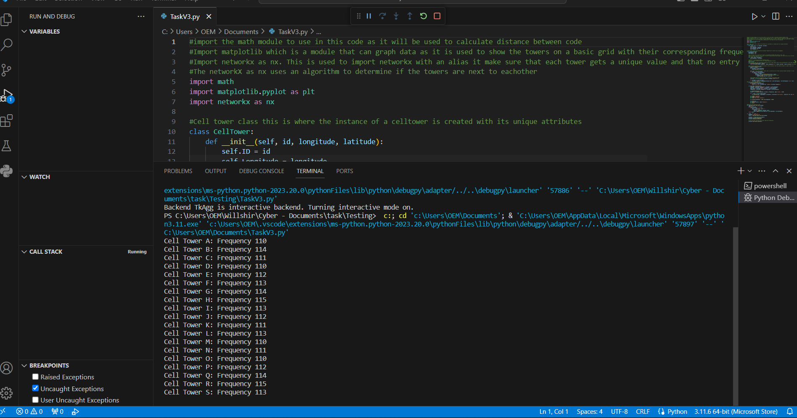

# CellTower_Task
This is the completion of a task to code the allocation of frequencies to towers based on their longitude and latitude values

##Output results

##Graph Displaying results
This graph displays the results of the frequency allocation program by assigning colors to each frequency and plotting the towers on a grid according to their location. This graph also further shows the accuracy of the program and how the allocation works

